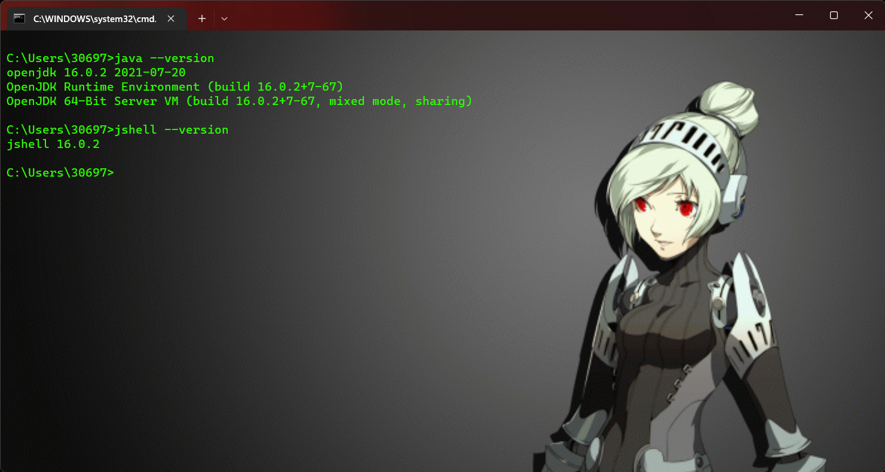
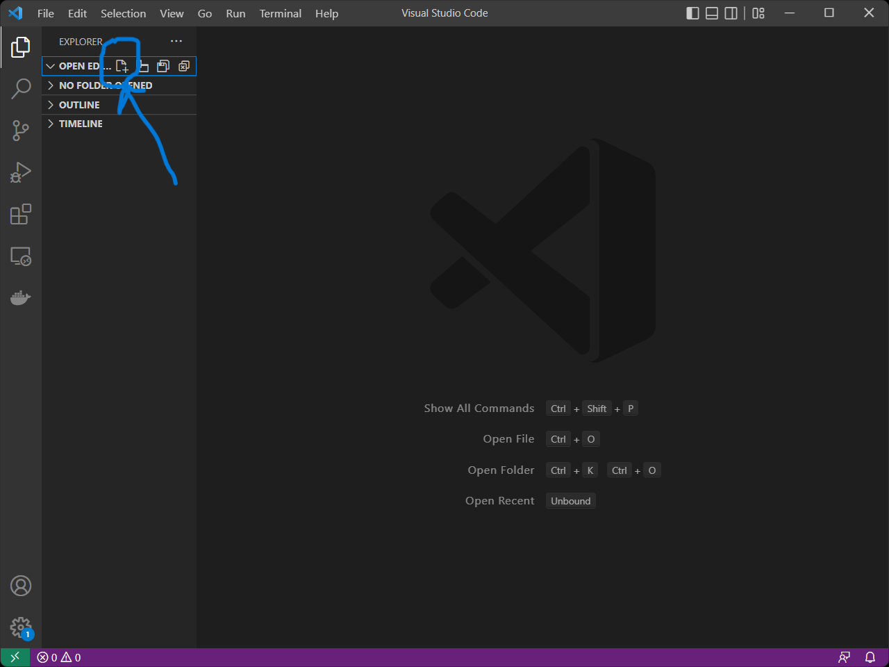

# Java Setup

## Εγκατάσταση Visual Studio Code

Για να τρέξουμε τα προγράμματα Java χρειαζόμαστε έναν text editor (επεξεργαστή κειμένου). Θα μπορούσαμε να χρησιμοποιήσουμε το notepad αλλά καλύτερα να χρησιμοποιήσουμε κάτι που διευκολύνει τον προγραμματισμό. Θα χρησιμοποιήσουμε το Visual Studio Code.

 Μπορείς να κατεβάσεις το Visual Studio Code για Windows στην ακόλουθη ιστοσελίδα:

```
https://code.visualstudio.com/download
```

Όταν κατέβει μπορείς να κάνεις την εγκατάσταση.

Αφού τελειώσει η εγκατάσταση ας ανοίξουμε το Visual Studio Code και παντώντας

```
CTRL + SHIFT + X
```

ανοίγουμε τα extensions. Ας εγκαταστήσουμε δύο extensions που θα μας φανούνε ιδιαίτερα χρήσιμα για προγραμματισμό σε Java:

```
Java Code Generator
Debugger for Java
```

και σε καθένα ξεχωριστά πατάς πάνω τους και κάνεις κλίκ install ή εγκατάσταση αναλόγως τη γλώσσα του λειτουργικού συστήματος που έχεις.


## Windows Update

Ας αναβαθμίσουμε τα Windows εαν υπάρχουν διαθέσιμες αναβαθμίσεις:

```
CTRL + R
ms-settings:windowsupdate
check for updates
```

Up to date? 🥳 Συνεχίζεις παρακάτω


## Εγκατάσταση της Java για Windows

Για να τρέξουμε προγράμματα Java πρέπει να κατεβάσουμε έναν compiler της γλώσσας που θα μπορεί να αποκωδικοποιεί σε γλώσσα μηχανής τις εντολές που δίνουμε.

Θα κατεβάσουμε την open source έκδοση ακολουθώντας τον σύνδεσμο:

```
https://download.java.net/java/GA/jdk18.0.1.1/65ae32619e2f40f3a9af3af1851d6e19/2/GPL/openjdk-18.0.1.1_windows-x64_bin.zip
```

Όπου έγινε download θα πάμε στον .zip φάκελο και θα κάνουμε δεξί κλίκ και extract all στην επιφάνεια εργασίας ή σε οποιονδήποτε φάκελο μπορείς να βρεις εύκολα.

Ύστερα θα ανοίξεις τον φάκελο και θα κάνεις δεξί κλικ και αντιγραφή το jdk-18.

Θα ανοίξεις τον file explorer

```
Windows + E
```

και θα πλοηγηθείς στο

```
C:\Program Files
```

όπου θα κάνεις Paste το αρχείο που αντέγραψες.

Σε αυτό το σημείο θα πλοηγηθείς μέσα στο αρχείο μέχρι να βρεις το bin (binary) φάκελο και όταν τον ανοίξεις θα κάνεις COPY + PASTE το μονοπάτι που εμφανίζεται στον file explorer.

Τέλος, πρέπει να πούμε στο λειτουργικό σύστημα που μπορεί να βρει τον compiler θέτοντας το μονοπάτι ως μεταβλητή περιβάλλοντος.

```
Windows + R
```

και γράφεις

```
SystemPropertiesAdvanced + ENTER
```

Πατάς το Environment Variables (Μεταβλητές Περιβάλλοντος).

Θέλουμε να προσθέσουμε το μονοπάτι στο System Variables. Βρίσκουμε το Path και πατάμε δεξί κλίκ και new και κάνουμε COPY+Paste > ΟΚ και κλείνουμε το παράθυρο.

Για να τεστάρουμε ότι όλα έχουν πάει σωστά, τέλος, ανοίγουμε τη γραμμή εντολών (command prompt):

```
Windows + R
cmd + ENTER
```

και στο παράθυρο που ανοίγει γράφεις τις εντολές

```
java --version
jshell --version
```

διαδοχικά. Πρέπει να δεις τα ακόλουθα μηνύματα

```
openjdk 16.0.2 2021-07-20
OpenJDK Runtime Environment (build 16.0.2+7-67)
OpenJDK 64-Bit Server VM (build 16.0.2+7-67, mixed mode, sharing)
```

και

```
jshell 16.0.2
```

(τα versions θα είναι διαφορετικά αλλά δεν μας πειράζει). Εάν δεν τα δεις, κάτι πήγε στραβά.



## Το πρώτο πρόγραμμα Java

Θέλουμε ένα μέρος που θα αποθηκεύουμε όλα τα προγράμματα java που θα γράψουμε. Στην επιφάνεια εργασίας μπορούμε να φτιάξουμε ένα φάκελο με όνομα

```
javacode
```

Εάν όλα είναι όπως πρέπει συνεχίζουμε στο τελευταίο βήμα. Ουφ! 🤯 👩‍💻

## Hello World στη Java


Στη συνέχεια, ανοίγουμε το visual studio code είτε από την αναζήτηση προγραμμάτων είτε από τη γραμμή εντολών (Hacker way) και πατάμε CTRL + N για τη δημιουργία νέου αρχείου.



Μπορείς να κάνεις copy-paste τον ακόλουθο πρόγραμμα

```
public class HelloWorld{

    public static void main(String[] args){
      System.out.println("Hello World!");
    }
}
```

και με CTRL + SAVE του δίνουμε το όνομα HelloWorld.java και ως προορισμό αποθήκευσης επιλέγουμε τον φάκελο javacode που φτιάξαμε παραπάνω στην επιφάνεια εργασίας.

Ύστερα πατάς το κουμπί Run ή F5. Εγκαθιστάς οτιδήποτε σου ζητήσει. Ύστερα το ξανατρέχεις και πρέπει στο κάτω μέρος να εμφανιστεί


```
Hello World!
```

Και είμαστε έτοιμες! Αυτό ήταν το πρώτο πρόγραμμα που έγραψες σε Java. 🧙🏾‍♀️ 🧙🏾‍♀️ 🧙🏾‍♀️
